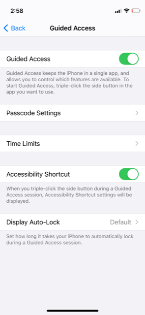

# Introduction
### This article has two things:

1. A focused list of "premium culture" sources that I believe are high-quality and worth your time
2. How to redirect your attention towards better content online

### I wrote this because:

1. Access to content has never been better. World-class books, articles, film, music is all literally a click away.
2. However, the vast majority of content is garbage - in an absolute sense.
3. In particular, "free" online content is usually click-bait, or worse.
4. Other content types (e.g. social) are designed to extract attention, time, and money from you as a content consumer (as this is how these platforms make money).
5. I have found a small set of premium content sources that solve this problem and get me 80-90% of the content I consume.

### This is a simple setup that I believe is a better way of consuming the good content.

I'll be updating this guide every 6 months or so; if you'd like to be updated when this guide changes, please leave your email address here:

	<TODO Insert email signup form here>

## Tools and setup
### Redirecting your attention FROM the internet TO something worth your time.

To start with, you need to break the habit of scrolling through your internet sources.

In order to do that, I wrote an Apple shortcut that automatically redirects me to my kindle app and locks me into guided access mode every time I open Safari.

This is a great pattern because it provides enough friction to prevent you from mindlessly opening apps. But, if you really do need to use an app (e.g. for work) then you can take the time to unlock it.

Prerequisites:
- "Shortcuts" app from Apple
- Kindle app from Amazon: This is my preferred e-book reader as subscribing to the sources below and any new books is really painless. I would love to support smaller publishers and I don't like Amazon's monopoly but pretty much all ebooks are available at Amazon and loading them onto the Kindle Just Works. 

1. In your iPhone settings, enable "Guided Access", and set a passcode (I use the same passcode as my unlock screen to make sure I remember it)

2. Now, triple clicking the power button will start "Guided Access" and limit you to using a single app (until you unlock it with another triple-click and the passcode).

3. Open up the "Shortcuts" app and create a new automation. This should look like the automation below:

4. When this automation is enabled, every time you open up Safari, your iPhone will open up your kindle app instead and lock you into guided access mode.

### Getting articles in easily digestible format with Calibre

I'll be updating this guide with a recommended format for reading journals in article format in Calibre (haven't gotten around to writing this yet).
	
If you'd like to be updated when I write this down, please leave your email address here:

 <form id="fs-frm" name="simple-contact-form" accept-charset="utf-8" action="https://formspree.io/f/mbjlopov" method="post">

<fieldset id="fs-frm-inputs">

<label for="email-address">Email Address</label>

<input type="email" name="_replyto" id="email-address" placeholder="email@domain.com" required="">

<input type="hidden" name="_subject" id="email-subject" value="Contact Form Submission">

</fieldset>

<input type="submit" value="Submit">

</form> 

## The sources

### Written journals

These are periodic sourced of articles. For written journals, you want

1. Hiqhest quality content possible
2. A balance of views from the left and right
3. Content in a wide range of interesting subject areas and topics

#### [New York Review of Books](https://www.nybooks.com/)

**Cost**: 1 year, $99

**Slant**: Liberal

**Good for**: Art, fiction books, history, subjects you didn't know you were interested in

This was the journal I started with. My grandfather was an ardent NYRB fan and I picked this source up from him. Some of these articles will show up in reputable online blogs (e.g. yCombinator, metafilter) every now and then.

For me, really good content I've found here is the work by [Rachel Cusk](https://en.wikipedia.org/wiki/Rachel_Cusk), among others.

#### [London Review of Books](https://www.lrb.co.uk/)

**Cost**: Kindle edition is $5 / issue, delivered biweekly

**Slant**: Liberal

**Good for**: Nonfiction, History, Europe

This is another journal that is (obviously) focused more on the London / UK side of things. I've been reading the LRB for about ~6 months at this point and I find that they have really good narrative perspectives and reviews.

#### [New Criterion](https://newcriterion.com/)

**Cost**: Annoyingly, no Kindle access; $5 / month

**Slant**: Conservative

**Good for**: Opposing viewpoints, music and art

This is a thoughtful conservative journal that is helpful to balance out point-of-views. The NYRB and the LRB are both left-of-center (although not extremely progressive). The New Criterion is helpful as a counterbalance (although you may need to be willing to deal with some out-there perspectives in the age of Trump).

#### [Wall Street Journal](https://www.wsj.com/)

**Cost**: ~$48 / year (depending on sales / specials)

**Slant**: Conservative

**Good for**: Key headlines / happenings

As the above journals are only published every month, you need a source for current events that is published more regularly. Without this source, you'll feel out-of-date and go back to checking your standard set of blogs every 30 minutes.

I have found that The Wall Street Journal is my preferred source for current events. This is because the NYTimes has pivoted to be very progressive, and I find that the NYRB and LRB do a more effective job at delivering those perspectives. The WSJ covers "just the facts" in a better way and also evens out your political views. 

### Streaming video

#### The Criterion Collection

**Cost**: $100 / year

**Slant**: None

**Good for**: Great streaming video content

This is a great collection of just really, really good movies. After scrolling through these films it takes me a few minutes to get excited about what I want to watch, but I have pretty much never been dissapointed.

For example, some good movies that I have watched that really effected me include:
- [Wanda (1970)](https://en.wikipedia.org/wiki/Wanda_(film))
- [Salesman (1969)](https://en.wikipedia.org/wiki/Salesman_(1969_film))
- [8 hours don't make a day (1972-1973)](https://en.wikipedia.org/wiki/Eight_Hours_Don%27t_Make_a_Day)

### Streaming music

#### Apple Music

**Cost**: $10 / month

**Slant**: None

**Good for**: Instant access to any music

The pattern here is typically music is written about in journals above - for example, downloading the [Glenn Gould's Goldberg Variations](https://music.apple.com/us/album/bach-goldberg-variations-bwv-988-the-1955-1981-recordings/594521223) while reading [this article](https://www.lrb.co.uk/the-paper/v14/n06/nicholas-spice/how-to-play-the-piano).

This source is good because it:

1. Has a massive collection
2. Is instantly available

So you can immediately get to a music source and listen next to the commentary supporting it. I've also heard Brian Wilson / Beach Boys, Don Cherry, Circuit des Yeux, and other artists I would have no occasion to try out without this source.

### Visual art: Status: TBD

I have not found a great source for this. But please stay posted as I am actively trying out alternatives:

	<TODO Insert email signup form here>

### Performance art: Status: TBD

While some performance art (e.g. Opera with the Met Opera) has good online streaming options, I have not found anything that was moving enough to merit a standalone subscription. Please stay posted as I am actively trying out alternatives:

	<TODO Insert email signup form here>
